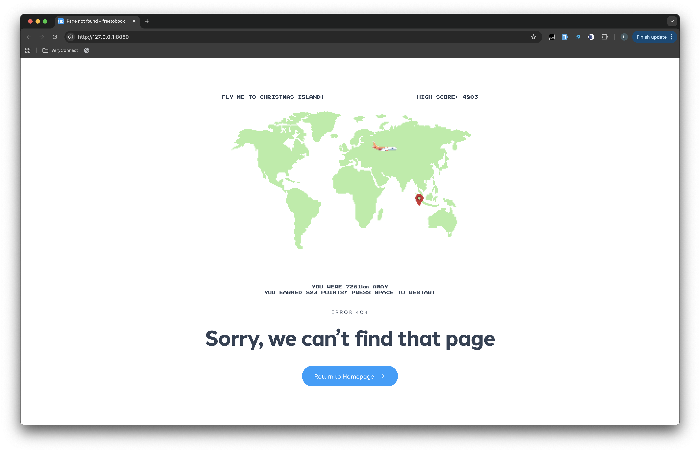

<p align="center">
  
</p>

# GUTS Hackathon 2025: freetobook 404 game

## Challenge

Build a small browser-based game that we could show to our users on error page. Imagine Chrome's no internet dino game, masswerks 404 tic tac toe game, figmas 404 shape editor.

The game should be:

- Lightweight and quick to load
- Capable of running offline
- Easy to understand
    - Simple controls
    - Minimal instructions needed
- Creative and fun

Bonus points!

- Themed around the travel industry
- Using freetobook's colour scheme

## Solution

GeoGuessr meets a claw machine. The user gets a country, presses once to lock the plane's horizontal position, presses again to lock its vertical position, and then receives a distance and score.

The game is a dependency-free custom web component written in plain JavaScript. It can run offline, embeds cleanly in a 404 page, and keeps the host page responsible only for layout and navigation.

## Run locally

Open `index.html` directly in a browser, or serve the folder with any static file server:

```sh
python3 -m http.server 4173
```

Then visit `http://localhost:4173`.

